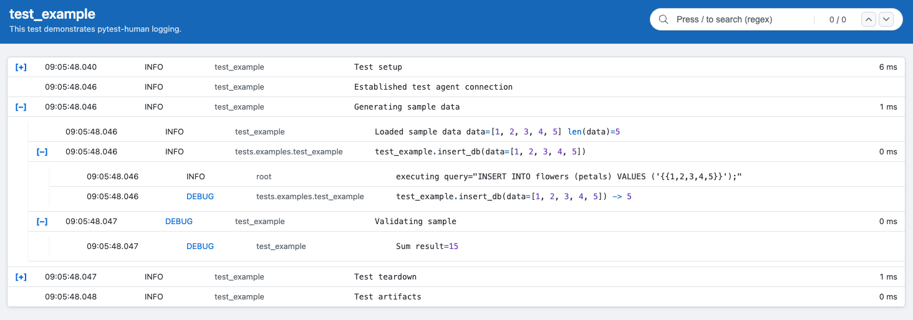
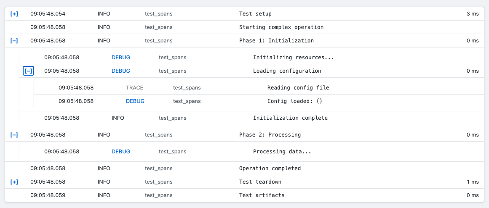
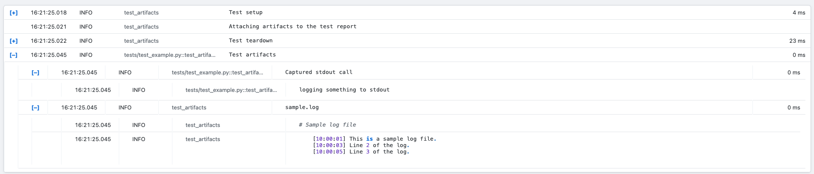

# pytest-human

[](https://pypi.org/project/pytest-human)
[](https://pypi.org/project/pytest-human)
[](https://github.com/Q-cue-ai/pytest-human/blob/main/LICENSE)


A pytest plugin for generating beautiful, human-readable HTML reports for individual tests with collapsible nested logging spans and syntax highlighting. Inspired by Robot Framework and Playwright reports.

Unlike other pytest HTML report plugins, **pytest-human** creates a separate HTML log file for each test, aimed at diving into specific parts of the test that are relevant for debugging.
No need to rewrite existing tests!.



## Features
* Beautiful test logs
* Collapsible spans
* Syntax highlighting
* Automatic fixture logging
* Automatic method call logging
* Third-party method tracing
* Colored log levels
* Deep error highlighting
* Regex search in collapsed spans
* Artifacts collection

## Installation

Install from PyPI:

```bash
pip install pytest-human
```

## Quick Start

### Basic Usage

1. Enable the plugin when running pytest:

    ```bash
    pytest --enable-html-log --log-level DEBUG --html-output-dir output/
    ```

    Setting the log level is important as the pytest default is high (`WARNING`).

2. Use the `human` objects in your tests:

    ```python
    from pytest_human.log import traced

    @traced()
    def insert_db(data):
        query = "INSERT INTO flowers (petals) VALUES ('{{1,2,3,4,5}}');"
        logging.info(f"executing {query=}")
        return len(data)

    def test_example(human):
        """This test demonstrates pytest-human logging."""
        human.log.info("Established test agent connection")

        with human.log.span.info("Generating sample data"):
            data = [1, 2, 3, 4, 5]
            human.log.info(f"Loaded sample data {data=} {len(data)=}", highlight=True)
            insert_db(data)

            with human.log.span.debug("Validating sample"):
                result = sum(data)
                human.log.debug(f"Sum {result=}", highlight=True)

        assert result == 15
    ```

3. Open the HTML test report

    At the end of individual tests you will see a similar line:

    ```console
    🌎 Test test_single_stage_ui HTML log at file:///tmp/pytest-of-john.doe/pytest-2/session_logs/test_frobulator.html
    ```

    You can <kbd>Ctrl</kbd>/<kbd>⌘</kbd>-Click the link in most terminals to open the file.

4. Debug!
     


## Command Line Options

### Enable HTML Logging


```bash
# To enable HTML logging support and use this plugin, pass this flag

pytest --enable-html-log
```

### Log Location

Control where HTML logs are saved:

```bash
# Save all test logs in a custom directory specified by the user.
pytest --html-output-dir /path/to/logs

# By default logs are saved in session temp directory with test name
pytest --enable-html-log 

# Save in individual test temporary directories as test.log
pytest --enable-html-log --html-use-test-tmp
```

### Log Level

Control the minimum log level:

```bash
# Use pytest's global log level.
# Opt to use this setting.
pytest --enable-html-log --log-level DEBUG

# Set log level for HTML logs specifically.
# This requires the root logger to be properly configured.
pytest --enable-html-log --html-log-level INFO

```

Setting the log level is critical, especially in the root log level as a lot of human's basic features are only available in `INFO`/`DEBUG` levels.
Setting the root log level is taken care of by pytest `--log-level` settings.

Available log levels: `TRACE`, `DEBUG`, `INFO`, `WARNING`, `ERROR`, `CRITICAL`

## Logger API

### Fixtures

- `human` - Supplies a human object to the test. Includes a logger and attachment collector.
- `test_log` - Supplies a logger to the test, equivalent to `human.log`. For helpers/fixtures prefer using `get_logger` instead. 
- `human_test_log_path` - Path of the html log file for the current test
### Logging Methods


```python
def test_logging_methods(human):
    # Basic logging at different levels
    human.log.trace("Trace level message")
    human.log.debug("Debug level message")
    human.log.info("Info level message")
    human.log.warning("Warning level message")
    human.log.error("Error level message")
    human.log.critical("Critical level message")
    
    # Syntax highlighting for code
    code = """
    import numpy as np

    def bark(volume: float) -> bool:
        return volume > 0.5:
    """
    human.log.info(code, highlight=True)
```

### Collapsible Spans




Create nested, collapsible sections in your HTML logs.

This allows partitioning the log into sections and diving only into the parts of the logs that are relevant to your debug session.

```python
def test_spans(human):
    human.log.info("Starting complex operation")
    
    with human.log.span.info("Phase 1: Initialization"):
        human.log.debug("Initializing resources...")
        
        # Nested span
        with human.log.span.debug("Loading configuration"):
            human.log.trace("Reading config file")
            config = load_config()
            human.log.debug(f"Config loaded: {config}")
        
        human.log.info("Initialization complete")
    
    # Another top-level span
    with human.log.span.info("Phase 2: Processing"):
        human.log.debug("Processing data...")
        process_data()
    
    human.log.info("Operation completed")
```

Available span methods:
- `span_trace(message)` - TRACE level span
- `span_debug(message)` - DEBUG level span
- `span_info(message)` - INFO level span
- `span_warning(message)` - WARNING level span
- `span_error(message)` - ERROR level span
- `span_critical(message)` - CRITICAL level span

## Method Tracing

```python
import logging
import time
from pytest_human.log import traced, get_logger

@traced()
def save_login(login):
    log = get_logger(__name__)
    log.info("a log inside save_login")
    return update_db(login)

@traced(log_level=logging.TRACE)
def update_db(login):
    log = get_logger(__name__)
    delay_time = 2
    log.info("delaying db update by 2 seconds")    
    time.sleep(delay_time)   
    return delay_time

def test_method_tracing(human):
    delay = save_login("hello")
    assert delay == 2
```

By adding the `@traced` decorator, the method will be
automatically logged when called and finished executing. The call
will be placed in a nested span, which will also include all further logging inside the function scope.

`@traced` supports the following parameters:
* `suppress_return` - do not log the return value, useful when it is overly long
* `suppress_params` - do not log the method parameters, useful when they are overly long
* `log_level` - set a log level for the method trace

## Third-party method tracing

The `@traced` decorator is very useful for debugging but it is unfortunately restricted to code you own.

In order to log third-party methods, you can use the `trace_calls` and `trace_public_api` methods, which monkey patch third party code with human tracing.

`trace_calls` adds logging to a list of functions, while `trace_public_api` adds logging to all public methods of modules/classes.

```python
@pytest.fixture(autouse=True)
def log_3rdparty_methods():
    with (
        trace_calls(
            pytest.Pytester.runpytest,
            pytest.Pytester.makepyfile,
        ),
        trace_calls(Page.screenshot, suppress_return=True),
        # this skips Page.screenshot as it is already defined above
        trace_public_api(Page, Locator, LocatorAssertionsImpl),
    ):
        yield
```


## Artifacts

Sometimes you might have extra logs that are generated by subprocesses or used resources such as
Kuberentes, Docker or others.
Human automatically collects stdout/stderr and allows you to collect custom logs to be attached to the log.



```python
def test_artifacts(human):
    human.log.info("Attaching artifacts to the test report")

    print("logging something to stdout")

    log_content = """
    [10:00:01] First line of the log.
    [10:00:03] Line 2 of the log.
    [10:00:05] Line 3 of the log.
    """
    human.artifacts.add_log_text(log_content, "sample.log", description="Sample log file")
```


## TRACE Logging

pytest-human adds a custom `TRACE` log level below `DEBUG` for more verbose logging:

```python
def test_trace_logging(human):
    human.log.trace("Very detailed trace information")
```

Run with trace level:

```bash
pytest --enable-html-log --log-level trace
```


## Extras

### Using Standard Python Logging

pytest-human integrates with Python's standard logging system. All logs from any logger will be captured:

```python
import logging

def test_standard_logging(human):
    # pytest-human logger
    human.log.info("Using human fixture")
    
    # Standard Python logger - also captured in HTML
    logger = logging.getLogger(__name__)
    logger.info("Using standard logger")
```

### Direct logger access

Get the test logger programmatically, useful for fixtures or inside helper functions:

```python
from pytest_human.log import get_logger

def test_programmatic_logger():
    logger = get_logger(__name__)
    logger.info("Custom logger")
```

### Keyboard navigation
You can use the keyboard to navigate around the log.
* Press <kbd>Tab</kbd> and <kbd>Shift</kbd>+<kbd>Tab</kbd> to jump between the expand buttons (+).
* Press <kbd>Enter</kbd> to expand and collapse a span when hovering over a button.
* Press <kbd>/</kbd> to jump to the search box and <kbd>Esc</kbd> to unfocus.
* When searching use <kbd>Enter</kbd> to jump to the next result and <kbd>Shift</kbd>+<kbd>Enter</kbd> to jump to the previous result.
## Development

### Running Tests

```bash
# Install development dependencies
pip install -e ".[dev]"

# Run tests
pytest

# Run with coverage
pytest --cov=pytest_human
```

Alternatively use tox

```bash
tox
```

### Building Documentation

```bash
mkdocs serve
```


## License

Distributed under the Apache Software License 2.0. See `LICENSE` for more information.


## Links

- **PyPI**: https://pypi.org/project/pytest-human
- **Repository**: https://github.com/Q-cue-ai/pytest-human
- **Issue Tracker**: https://github.com/Q-cue-ai/pytest-human/issues

